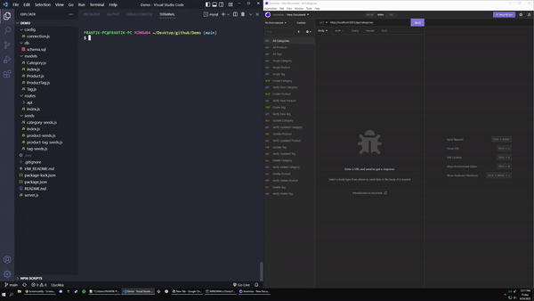

# 13-ORM-Homework

## Table of Contents 📑
- [Description](#description)
- [Application Preview](#application-preview)
- [Installation](#installation)
- [Usage](#usage)
- [Links](#links)
- [Criteria](#criteria)
- [Technologies](#technologies)
- [Questions](#questions)
- [License](#license)

## Description
Build the back end for an e-commerce site by modifying starter code. Configure a working Express.js API to use Sequelize to interact with a MySQL database.

## Application Preview

    

    

## Installation
- Copy the repository to your system
- Create .env file
    - SET DB_NAME to 'ecommerce_db'
    - SET DB_USER to 'YOUR-MYSQL-USERNAME'
    - SET DB_PASSWORD to 'YOUR-MYSQL-PASSWORD'
- npm install
- Load schema.sql via MySQL command line:
    - source schema.sql
- npm run seed
- node index.js

## Usage
Back End application using CRUD API routes with a MySQL database

## Links
-   Github Repository:
    - https://github.com/brianalegre/12-MySQL-Homework
-   Video Demo (YouTube):
    - https://youtu.be/Jc4VCyV0nwQ
-   Vide Demo (Github):
    - https://github.com/brianalegre/13-ORM-Homework/blob/main/assets/images/ECommerceBackEndDemo.mp4

## Criteria
- Use a .env file
- Connect to MySQL Database via Sequalize
- Create Dev Database via schema and seed commands
- API GET Routes display JSON formatted data
    - GET will return ALL data in the sections below:
    - GET Will return SINGLE data in the sections below:
        - Categories
        - Products
        - Tags
- API POST, PUT, DELETE Routes
    - Successfully Create, Update, and Delete data in Dev Database
- Associations
    - Products BELONGS-TO Category
        - Category HAS-MANY Product
    - Prodcut BELONGS-TO Tag
        - Tag BELONGS-TO-MANY Product

## Technologies
- MySQL2
- Sequelize
- dotenv

## Questions
Questions? Concerns?  Contact Me Below:
- Github Username: brianalegre
- Github Link: https://github.com/brianalegre 
- Email: brialegre@yahoo.com

## License
- Copyright 2022 Brian Alegre
- Licensed under the: [MIT License](https://opensource.org/licenses/MIT) 

